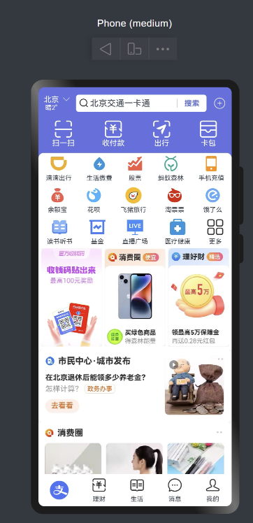

## 界面效果


## 代码

```
@Entry
@Component
struct AliPayIndexPage {
  build() {
    Stack({ alignContent: Alignment.Bottom }) {
      Stack({ alignContent: Alignment.Top }) {
        // 顶部搜索栏
        this.TopSearchBar()

        // 主体
        this.Body()
      }
      .width('100%')
      .height('100%')
      .backgroundColor('#5b73e1')

      // 底部导航栏
      this.BottomNavigation()
    }
    .height('100%')
    .width('100%')
    .backgroundColor(Color.Pink)
  }

  @Builder TopSearchBar() {
    Row() {
      Column() {
        Text('北京')
          .fontSize(14)
          .fontColor(Color.White)
        Text('晴2°')
          .fontSize(12)
          .fontColor(Color.White)
        Image($r('app.media.zfb_head_down'))
          .fillColor(Color.White)
          .width(14)
          .position({
            x: 35
          })
      }

      Row() {
        Image($r('app.media.zfb_head_search'))
          .width(20)
          .fillColor('#666')
        Text('北京交通一卡通')
          .margin({
            left: 1
          })
          .layoutWeight(1)

        Text('搜索')
          .width(55)
          .fontColor('#5b73d1')
          .fontSize(14)
          .fontWeight(FontWeight.Bold)
          .textAlign(TextAlign.Center)
          .border({
            width: {
              left: 1,
            },
            color: '#ccc'
          })

      }
      .borderRadius(5)
      .height(32)
      .padding({
        left: 5
      })
      .margin({
        left: 32,
        right: 12
      })
      .backgroundColor(Color.White)
      .layoutWeight(1)

      Image($r('app.media.zfb_head_plus'))
        .width(25)
        .fillColor(Color.White)
    }
    .width('100%')
    .padding({
      left: 10,
      right: 10
    })
    .height(60)
    .backgroundColor('#5b73e1')
    .zIndex(10)
  }

  @Builder Body() {
    Scroll() {
      Column() {
        this.QuickNavMenu()
        this.CardArea()
        this.ProductArea()
      }
      .width('100%')
      .padding({
        top: 60,
        bottom: 60
      })
    }
    .scrollBar(BarState.Off)
  }

  @Builder QuickNavMenu() {
    Row() {
      Column() {
        Image($r('app.media.zfb_top_scan'))
          .width(36)
          .fillColor(Color.White)
        Text('扫一扫').quickNavTextStyleExtend()
      }

      Column() {
        Image($r('app.media.zfb_top_pay'))
          .width(36)
          .fillColor(Color.White)
        Text('收付款').quickNavTextStyleExtend()
      }

      Column() {
        Image($r('app.media.zfb_top_travel'))
          .width(36)
          .fillColor(Color.White)
        Text('出行').quickNavTextStyleExtend()
      }

      Column() {
        Image($r('app.media.zfb_top_card'))
          .width(36)
          .fillColor(Color.White)
        Text('卡包').quickNavTextStyleExtend()
      }
    }
    .justifyContent(FlexAlign.SpaceAround)
    .width('100%')
  }

  @Builder CardArea() {
    Column({ space: 10 }) {
      Row() {
        Column({ space: 5 }) {
          Image($r('app.media.zfb_nav1'))
            .width(30)
          Text('滴滴出行')
            .fontSize(12)
        }

        Column({ space: 5 }) {
          Image($r('app.media.zfb_nav2'))
            .width(30)
          Text('生活缴费')
            .fontSize(12)
        }

        Column({ space: 5 }) {
          Image($r('app.media.zfb_nav3'))
            .width(30)
          Text('股票')
            .fontSize(12)
        }

        Column({ space: 5 }) {
          Image($r('app.media.zfb_nav4'))
            .width(30)
          Text('蚂蚁森林')
            .fontSize(12)
        }

        Column({ space: 5 }) {
          Image($r('app.media.zfb_nav5'))
            .width(30)
          Text('手机充值')
            .fontSize(12)
        }
      }
      .justifyContent(FlexAlign.SpaceAround)
      .width('100%')

      Row() {
        Column({ space: 5 }) {
          Image($r('app.media.zfb_nav6'))
            .width(30)
          Text('余额宝')
            .fontSize(12)
        }

        Column({ space: 5 }) {
          Image($r('app.media.zfb_nav7'))
            .width(30)
          Text('花呗')
            .fontSize(12)
        }

        Column({ space: 5 }) {
          Image($r('app.media.zfb_nav8'))
            .width(30)
          Text('飞猪旅行')
            .fontSize(12)
        }

        Column({ space: 5 }) {
          Image($r('app.media.zfb_nav9'))
            .width(30)
          Text('淘票票')
            .fontSize(12)
        }

        Column({ space: 5 }) {
          Image($r('app.media.zfb_nav10'))
            .width(30)
          Text('饿了么')
            .fontSize(12)
        }
      }
      .justifyContent(FlexAlign.SpaceAround)
      .width('100%')

      Row() {
        Column({ space: 5 }) {
          Image($r('app.media.zfb_nav11'))
            .width(30)
          Text('读书听书')
            .fontSize(12)
        }

        Column({ space: 5 }) {
          Image($r('app.media.zfb_nav12'))
            .width(30)
          Text('基金')
            .fontSize(12)
        }

        Column({ space: 5 }) {
          Image($r('app.media.zfb_nav13'))
            .width(30)
          Text('直播广场')
            .fontSize(12)
        }

        Column({ space: 5 }) {
          Image($r('app.media.zfb_nav14'))
            .width(30)
          Text('医疗健康')
            .fontSize(12)
        }

        Column({ space: 5 }) {
          Image($r('app.media.zfb_nav15_more'))
            .width(30)
          Text('更多')
            .fontSize(12)
        }
      }
      .justifyContent(FlexAlign.SpaceAround)
      .width('100%')

    }.cardAreaColumnStyleExtend()
  }

  @Builder ProductArea(){
    Row({space:5}){
      Image($r('app.media.zfb_pro_pic1'))
        .layoutWeight(1)
      Image($r('app.media.zfb_pro_pic2'))
        .layoutWeight(1)
      Image($r('app.media.zfb_pro_pic3'))
        .layoutWeight(1)
    }
    .padding(5)
    .backgroundColor(Color.White)
    .width('100%')

    Column(){
      Image($r('app.media.zfb_pro_list1'))
      Image($r('app.media.zfb_pro_list2'))
    }
  }

  @Builder BottomNavigation() {
    Row() {
      Column() {
        Image($r('app.media.zfb_tab_home'))
          .width(35)
      }

      Column() {
        Image($r('app.media.zfb_top_pay'))
          .inactiveNavigationImage()
        Text('理财').textStyleExtend()
      }

      Column() {
        Image($r('app.media.zfb_tab_life'))
          .inactiveNavigationImage()
        Text('生活').textStyleExtend()
      }

      Column() {
        Image($r('app.media.zfb_tab_chat'))
          .inactiveNavigationImage()
        Text('消息').textStyleExtend()
      }

      Column() {
        Image($r('app.media.zfb_tab_me'))
          .inactiveNavigationImage()
        Text('我的').textStyleExtend()
      }

    }
    .justifyContent(FlexAlign.SpaceAround)
    .width('100%')
    .height(60)
    .backgroundColor(Color.White)
  }
}


@Extend(Text) function textStyleExtend() {
  .fontSize(12)
  .margin({
    top: 5
  })
}

@Extend(Text) function quickNavTextStyleExtend() {
  .fontSize(14)
  .fontColor(Color.White)
}

@Extend(Image) function inactiveNavigationImage() {
  .width(28)
}

@Extend(Column) function cardAreaColumnStyleExtend() {
  .width('100%')
  .backgroundColor(Color.White)
  .borderRadius({
    topLeft: 10,
    topRight: 10
  })
  .padding({
    top: 5
  })
  .margin({
    top: 10
  })
}
```
