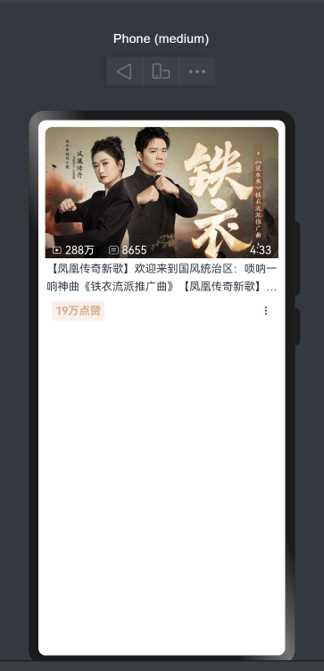

## 界面效果


## 代码

``` ts
@Entry
@Component
struct BliBliVideoCardPage {
  @State message: string = 'Hello World'

  build() {
    Column() {
      Column() {
        Stack({ alignContent: Alignment.Bottom }) {
          Image($r('app.media.bz_img'))
            .width('100%')
            .borderRadius({ topLeft: 10, topRight: 10 })
          Row() {
            Row({ space: 5 }) {
              Image($r('app.media.bz_play'))
                .width(14)
                .fillColor(Color.White)
              Text('288万').fontColor(Color.White)
            }
            .margin({ right: 20 })

            Row({ space: 5 }) {
              Image($r('app.media.bz_msg'))
                .width(14)
                .fillColor(Color.White)
              Text('8655').fontColor(Color.White)
            }

            Blank()

            Text('4:33').fontColor(Color.White)
          }
          .padding({ left: 10, right: 10 })
          .height(24)
          .width('100%')
        }


        Column() {
          Text('【凤凰传奇新歌】欢迎来到国风统治区：唢呐一响神曲《铁衣流派推广曲》【凤凰传奇新歌】欢迎来到国风统治区：唢呐一响神曲《铁衣流派推广曲》')
            .textOverflow({ overflow: TextOverflow.Ellipsis })
            .maxLines(2)
            .fontSize(16)
            .lineHeight(26)
          Row() {
            Text('19万点赞')
              .fontColor('#e5a986')
              .fontWeight(FontWeight.Bold)
              .backgroundColor('#fbefed')
              .padding(5)
              .borderRadius(5)
            Image($r('app.media.bz_more')).width(16)
          }
          .padding(10)
          .width('100%')
          .backgroundColor(Color.White)
          .justifyContent(FlexAlign.SpaceBetween)
        }
      }
      .margin(10)

    }
    .width('100%')
    .height('100%')
  }
}
```