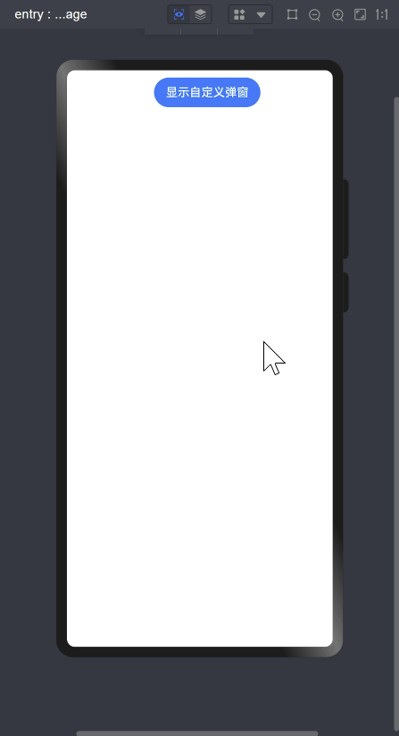

## ArkTs自定义弹框

效果图：



## 实现代码

``` ts
// 一个内容可以滚动的单选列表
import promptAction from '@ohos.promptAction'

@Entry
@Component
struct CustomDialogPage {
  dialogController: CustomDialogController = new CustomDialogController({
    builder: MyCustomDialog({ cancel: this.onCancel, confirm: this.onConfirm }),
    alignment: DialogAlignment.Bottom,
    offset: { dy: 0, dx: 0 }, // 弹窗相对alignment所在位置的偏移量，即设置弹框相对于底部向上偏移10个vp
    autoCancel: true, // 点击弹框外的地方自动关闭
    customStyle: true // 弹窗容器样式是否自定义。默认值：false，弹窗容器的宽度根据栅格系统自适应，不跟随子节点；高度自适应子节点，最大为窗口高度的90%；圆角为24vp
  })

  onCancel() {
    // 注入取消钩子
    console.log('onCancel')
  }

  onConfirm() {
    // 注入确定钩子
    console.log('您点击了确定')
  }

  build() {
    Column() {
      Button('显示自定义弹窗')
        .onClick(() => {
          this.dialogController.open()
        })
    }
    .margin(10)
    .width('100%')
  }
}

/**
 * 自定义弹窗组件
 */
@CustomDialog
struct MyCustomDialog {
  @State students: Student[] = []
  controller: CustomDialogController
  cancel: () => void
  confirm: () => void

  aboutToAppear() {
    this.students = this.loadData()
  }

  loadData(): Array<Student> {
    // 加一个英文字符串，模拟器和预览器中不支持中文搜索
    let names: string[] = ['Farb', '小明', '小红', '小刚', '小美', '小杜', '小帅', '小李', '小王', '小刘', '小杨', '小宋']
    const data: Student[] = []
    let i: number
    for (i = 0; i < names.length; i++) {
      data.push(new Student(i + 1, names[i]))
    }
    return data
  }

  build() {
    Stack({ alignContent: Alignment.Bottom }) {
      Stack({ alignContent: Alignment.Top }) {
        this.Header()
        this.Body()
      }.height('100%') // 保证内嵌的Stack高度也铺满整个容器，防止搜索时容器变小
      .backgroundColor(Color.White)

      this.Footer()
    }
    .height('60%') // 弹框最占屏幕的60%高度
  }

  /**
   * 显示头部信息：包括标题和搜索框
   */
  @Builder Header() {
    Column() {
      Text('请选择一个学生').fontSize(20).margin({ top: 10, bottom: 10 })
      TextInput({ placeholder: '请输入学生姓名进行搜索' })
        .placeholderColor('#ccc')
        .onChange(value => {
          if (value) {
            this.students = this.loadData().filter(item => item.name.toLowerCase().indexOf(value.toLowerCase()) >= 0)
          } else {
            this.students = this.loadData()
          }
        })
    }.height(100)
    .padding(10)
    .zIndex(10) // 让Header位于最上面
    .backgroundColor(Color.White)
  }

  /**
   * 显示主体列表
   */
  @Builder Body() {
    Column() {
      Scroll() {
        Column() {
          ForEach(this.students, (item: Student) => {
            StudentCard({ student: item })
          })
        }
        .padding({ // 这里要分别留出header和footer的高度
          bottom: 50,
          top: 100
        })
      }
      .scrollBar(BarState.Off)
    }
  }
  /**
   * 显示底部按钮
   */
  @Builder Footer() {
    Button('取消')
      .width('100%')
      .height(50)
      .fontSize(18)
      .fontWeight(FontWeight.Bold)
      .fontColor('#3CBEF5')
      .backgroundColor(Color.White)
      .type(ButtonType.Normal)
      .onClick(() => {
        this.controller.close()
        this.cancel();
      })
  }
}


/**
 * 封装每一行数据
 */
@Component
struct StudentCard {
  @ObjectLink student: Student

  build() {
    Row() {
      Text(this.student.name)
        // 这里可根据需要调整布局，当前默认让student.name占据除了单选按钮的剩余所有空间
        .layoutWeight(1)
      Radio({ value: '', group: 'default' })
        .checked(this.student.isChecked)
        .onChange(isChecked => {
          // 每个单选按钮状态的变化都要同步到student属性isChecked上
          this.student.isChecked = isChecked
          promptAction.showToast({ message: `您选择的是${this.student.name}` })
        })
    }
    .border({
      width: {
        bottom: 1,
      },
      color: '#ddd'
    })
    .padding(10)
    .justifyContent(FlexAlign.Center)
    .onClick(() => {
      this.student.isChecked = true
    })
    .width('100%')
  }
}


@Observed
class Student {
  id: number
  name: string
  isChecked: boolean

  constructor(id: number, name: string, isChecked?: boolean) {
    this.id = id
    this.name = name
    this.isChecked = isChecked
  }
}
```