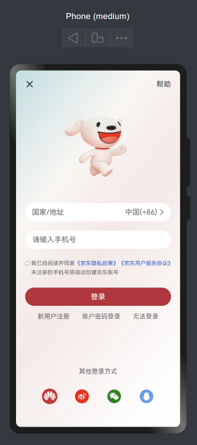

## 界面效果


## 代码

```
@Component
@Entry
struct JdLogin {
  build() {
    Column() {
      Row() {
        Image($r('app.media.jd_cancel'))
          .width(20)
        Text('帮助').fontSize(16)
      }.width('100%')
      .justifyContent(FlexAlign.SpaceBetween)

      Image($r('app.media.jd_logo'))
        .width(250)

      Row() {
        Text('国家/地址').fontColor('#666').layoutWeight(1)
        Text('中国(+86)').fontColor('#666')
        Image($r('app.media.jd_right')).width(20).fillColor('#666')
      }
      .width('100%')
      .height(40)
      .backgroundColor('#fff')
      .borderRadius(20)
      .padding({ left: 15, right: 10 })

      TextInput({ placeholder: '请输入手机号' })
        .placeholderColor('#666')
        .height(40)
        .borderRadius(20)
        .backgroundColor('#fff')
        .margin({ top: 20 })

      Row() {
        Checkbox().width(10).margin({ top: 7, right: 3 })
        Text() {
          Span('我已经阅读并同意')
          Span('《京东隐私政策》').fontColor('#26d').fontSize(12)
          Span('《京东用户服务协议》').fontColor('#26d').fontSize(12)
          Span('未注册的手机号将自动创建京东账号')
        }.fontSize(12)
        .fontColor('#666')
        .lineHeight(20)

      }.alignItems(VerticalAlign.Top)
      .margin({ top: 20 })

      Button('登录')
        .width('100%')
        .backgroundColor('#bf2838')
        .margin({ top: 25 })

      Row() {
        Text('新用户注册').fontSize(14).fontColor('#666')
        Text('账户密码登录').fontSize(14).fontColor('#666')
        Text('无法登录').fontSize(14).fontColor('#666')
      }.width('100%')
      .margin({ top: 15 })
      .justifyContent(FlexAlign.SpaceEvenly)

      Blank()

      Text('其他登录方式')
        .fontColor('#666')
        .fontSize(14)
        .lineHeight(22)
        .margin({ bottom: 28 })
      Row() {
        Image($r('app.media.jd_huawei')).width(34)
        Image($r('app.media.jd_weibo')).width(34).fillColor(Color.Red)
        Image($r('app.media.jd_wechat')).width(34).fillColor(Color.Green)
        Image($r('app.media.jd_QQ')).width(34).fillColor('#539feb')
      }.width('100%')
      .margin({ bottom: 30 })
      .justifyContent(FlexAlign.SpaceEvenly)
    }.height('100%')
    .padding(20)
    .backgroundImage($r('app.media.jd_login_bg'))
    .backgroundImageSize(ImageSize.Cover)
  }
}
```