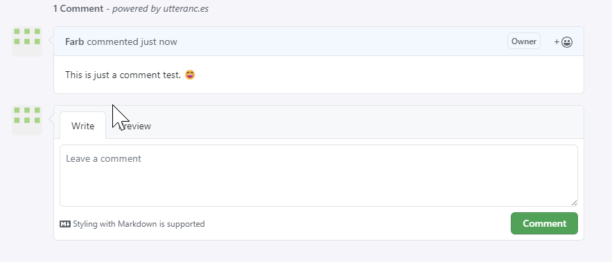
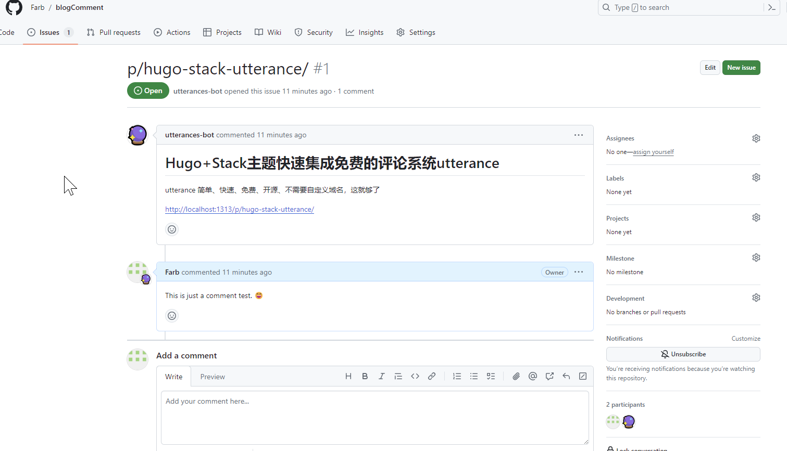

## 实验经历

在网上看了很多方案，最终选择了utterance，因为utterance 简单、快速、免费、开源、不需要自定义域名，这就够了。

了解了静态博客的评论系统基本都是依赖一个动态的第三方后端系统，因为涉及到保存用户评论数据。

我梳理了下，主要有这么几个概念：
1. 云服务提供方： 提供最终对博客页面暴露的接口，在你的静态博客中嵌入一段JavaScript代码就可以显示评论系统。
2. 博客系统提供方：负责开发评论对话框的人（一般都是nodejs开发），主要就是评论的样式不同，可以以不同的社交方式登录。
3. 数据库提供方：最终的评论内容要保存到哪里。

比较流行的云服务提供方包括：**[Vercel](https://vercel.com/)、[Netlify](https://app.netlify.com/)** 等等，当然还有国内的云服务提供商，基本都收费，也可以自己部署，说白了，就是部署一个nodejs服务对外提供接口。

比较流行的博客系统提供方包括：**[Waline](https://waline.js.org/)、[Twikoo](https://twikoo.js.org/)** 等等

比较流行的免费的数据库提供方包括：**[LeanCloud](https://leancloud.app/),[Mongodb](https://mongodb.com)** 等等

**LeanCloud和Mongodb都可以免费部署好服务，Waline和Vercel文档也都很友好，一看就知道怎么部署。我也在Vercel上部署成功了，但是最后发现部署的应用打不开，网上的解决办法是使用自己的域名就可以解决问题，但考虑到国内申请域名还要备案，免费且不用备案的域名[Freenom](https://www.freenom.com/)半天打不开，于是就不考虑了。最终选择了utterance**

utterance，英文意思是`言论，说话`。它是Github市场的一个应用，可以直接安装，然后关联自己的一个公开仓库即可，后面评论的内容都会保存到这个仓库的issue里面。
对比上面的3个概念，你可以理解为Github的东家就是这三个提供方。只不过，utterance的开发者将上面的三个概念对应的服务给打包好了，方便博主直接使用。

**[utterance官方文档](https://utteranc.es/)**


## Hugo Stack中如何配置
1. 找到配置文件： config\_default\params.toml
2. 修改评论系统的provider以及`[comments.utterances]`节点下的`repo`为你自己的仓库名称。代码如下：
   ```
    ## Comments
    [comments]
    enabled = true
    provider = "utterances"   ## 修改点

    [comments.utterances]
    repo = "farb/blogComment" ## 修改点
    issueTerm = "pathname"
    label = "
   ```

最后，看下我的效果吧




可以看到这个评论最终保存到了 farb/blogComment 这个仓库下面的issue。
每篇帖子都会开一个issue，issue的名字就是博客的slug-name(路径名)，所有的评论都在这个issue下面。
