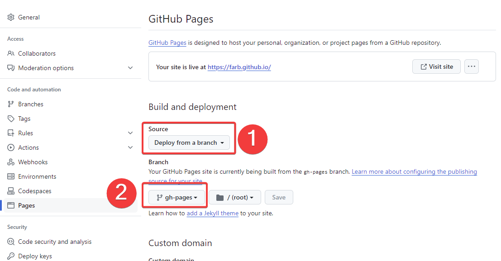

## 参考文档
[Hugo 官方文档](https://gohugo.io/)

[Stack 官方文档](https://stack.jimmycai.com/)

**一开始按照上面两个官方文档搞好了本地环境，本地 `http://localhost:1313/`可以正常打开访问。但是代码提交到Github之后，并没有效果，显示的readme.md的内容，于是各种查找答案，终于通过下面这个帖子解决了。特此记录。**

[参考这个帖子解决了问题](https://zhuanlan.zhihu.com/p/597460995)

## 问题的原因

上面知乎那个帖子也提到了，主要有两点：

1. Source 要选择 `Deploy from a branch` 
2. 注意分支，Git仓库会触发Github Action自动新建一个gh-page的分支，会自动把content文件夹里面的内容编译到一个public文件夹，一个纯前端文件的项目，这个gh-page分支的内容就是public文件夹的内容。

修改上面的两处之后，点击图上方的**Visit site** 成功看到博客主页。

## Github同步到Gitee

该指导可以提交一次代码到Github，然后同时同步到Gitee并部署。

https://github.com/marketplace/actions/gitee-pages-action